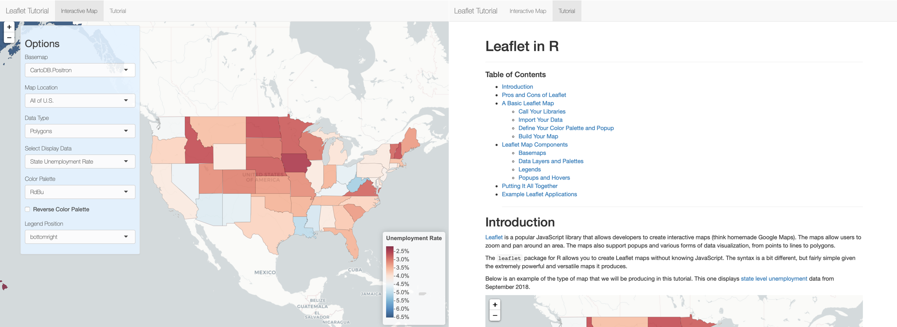

# Leaflet Tutorial

## Overview
This application and the associated markdown file were created as part of a tutorial/demonstration I am offering at a workshop called Government Advances in Statistical Processing. As part of the demonstration, I wanted to create an application that shows off the basic features of the `leaflet` package in R; loading different basemaps; displaying point, line, polygon, and raster data; and various options for popups, color palettes, and legends. 

## Usage
You are welcome to use this application if you'd like. 

## Caveats
  * All of the data used in the examples is open and publically available
  * The views expressed in the markdown document and the data shown do not necessarily represent the views of my employer.
  
## Contact
Feel free to contact me through Github with any comments or questions you have about the app.